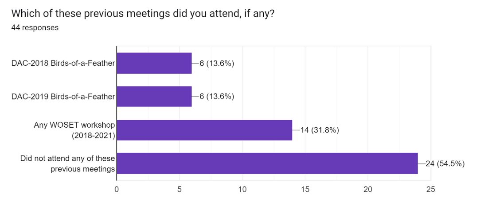
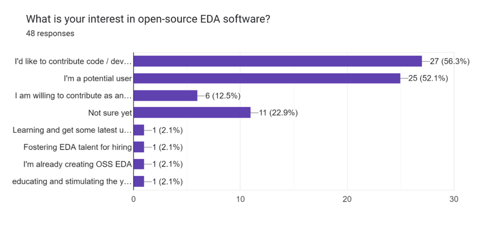
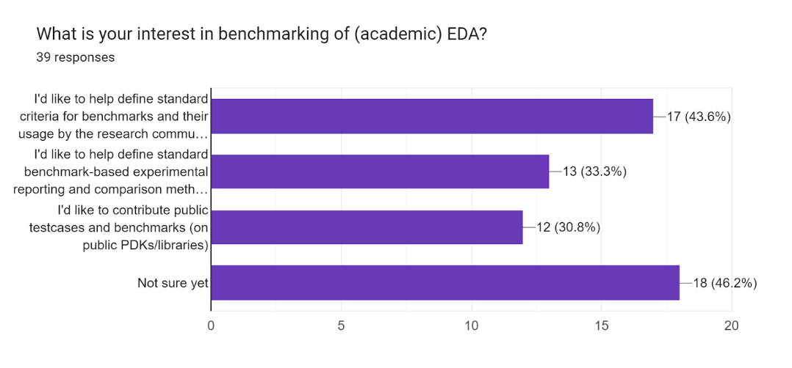

# Open-Source EDA Birds-of-a-Feather Meeting at DAC
[https://59dac.conference-program.com/session/?sess=sess294](https://59dac.conference-program.com/session/?sess=sess294)

July 12, 2022
7:00pm-10:00pm, Moscone West Room 3000
 
This Birds-of-a-Feather meeting is the third in a series that began with the DAC 2018 and 2019 Open-Source Academic EDA Software Birds-of-a-Feather meetings, and that has a number of participants who also attend the WOSET workshop.  This year, the topic of benchmarking is being added to the discussion.  This session serves as an informal meeting point for anyone who would like to hear or share ideas or latest news on (1) the ecosystem of open-source EDA tools, and/or (2) the use of relevant and principled benchmarking methodologies to clarify and advance the leading edge of EDA research. Goals for the community, along with current landscape, key updates, and potential next steps / actions for the worldwide academic/CAD community are all topics for discussion. Potential contributors, developers, advisors, users … Everyone is WELCOME !!! (Please send email to abk@eng.ucsd.edu with any questions.)

# AGENDA (tentative)

### Welcome and Introduction 7:00pm

### Open-Source EDA 7:10pm

- Tom Spyrou, UC San Diego and Precision Innovations

  - "OpenROAD: 3 Years in Perspective"
  
- Andreas Olofsson, Zero ASIC

  - "SiliconCompiler"
  
- Johan Euphrosin, Google
  
  - "Parameters exploration using Jupyter notebook and Google Vizier"
  
- Siang-Yun (Sonia) Lee, EPFL

  - "Showcase and updates of the EPFL logic synthesis libraries ([https://github.com/lsils/lstools-showcase](https://github.com/lsils/lstools-showcase))"

- Ulf Schlichtmann, TU Munich
 
  - "System-level tools (e.g., Instruction Set Simulator) recently open-sourced"

- Oron Port, DFiant

  - "DFiant cloud solution that offers access to OSS EDA flows"

- Late-Breaking News and Discussion (what next, what is needed, who can contribute …)

### Benchmarks and Data  ~8:00pm

- Ismail Bustany, AMD

  - "FPGA macro placement benchmark suite"

- Siang-Yun (Sonia) Lee, EPFL

  - "New repository of benchmarks and best results targeting superconducting electronics ([https://github.com/lsils/SCE-benchmarks](https://github.com/lsils/SCE-benchmarks))"
  
- Andrew Kahng, UCSD

  - Efforts toward open data and benchmarking in the TILOS AI Institute: MacroPlacement and SpecPart"
  
- Sergio Guadarrama, Google

  - "Circuit Training ([https://github.com/google-research/circuit_training](https://github.com/google-research/circuit_training)), the open-source library for floorplanning using RL that my team and Google has open sourced recently as described in the 'A graph placement methodology for fast chip design' paper"

- Late-Breaking News and Discussion (what next, what is needed, who can contribute …)

### New Research Foundations ~8:50pm

- Antonino Tumeo, Pacific Northwest National Laboratory.  

  - "Push for an Open Hardware Technology Commons in Coordination with the NIST National Semiconductor Technology Center"
  
- David Junkin, Cadence

  - "How persons developing flows and other work products can share those with colleagues"
  
- Late-Breaking News and Discussion (what next, what is needed, who can contribute …)

### A Prediction Exercise: What Will Be New/Improved by Next Year?  ~9:30pm

- (All)

### Adjourn, Continue Discussions over Beverages  ~9:45pm

# Registration
There is no registration fee. However, please fill in [this Google Form](https://docs.google.com/forms/d/e/1FAIpQLSczKTmaTTg_DlrXA0mQ7tYq65e5lte8ldJFgJrKDWqhbpDXpQ/viewform?usp=sf_link) to indicate your interests and whether you would like to share something with other attendees.

# Organization
This year's session is being organized by Andrew Kahng (abk@eng.ucsd.edu) and Tom Spyrou (aspyrou@eng.ucsd.edu).

# Previous Open-Source EDA Birds-of-a-Feather meetings

- [DAC-2019](https://github.com/The-OpenROAD-Project/Birds-of-a-Feather-Open-Source-Academic-EDA-Software/wiki/DAC-2019-Birds-of-a-Feather:-Open-Source-Academic-EDA-Software) (wiki with slides, attendees, atlas of open-source EDA projects)

- [DAC-2018](https://drive.google.com/open?id=1m8ZJEvfLcUhiL1KX7rj18gzi-zLhI6P2) (slides)

# Background for Today's Meetings

### Initial Survey Responses (39)

### What would you most like to see discussed at the meeting?

- Opensource EDA tools impact on the CHIPS ACT

- The path forward for open source community

- Verification, standard benchmarks

- Real experiences of different open source usage models

- How can we accelerate adoption of ML in chip design processes?

- Analog design benchmarks

- What prevents companies from not only adopting OSS EDA but also contributing to it?

- Current development of open-source EDA tools

- State of open source tools, and priorities/initiatives being planned.

- Come up with a distributed way to "maintain" designs submitted to Open MPW at scale (much like GNU/Linux distributiion packagers manage to maintain an impressive amount of FLOSS software packages)

  1. Elements and commitments of data and benchmarking infrastructure that enable the field to transparently move forward. 
  
  2. Key ("core") optimization problem statements that are the most important for the field to advance. 
  
  3. Open enablement of machine learning to advance optimization methodologies.
  
- Educational activities and advocacy movements worldwide for Open-Source EDA. 
I am curious to learn more about the OpenRoad initiative and open-source API standards that allow "plug-and-play" in the PD flow along with data harvesting.

  1. Will open source EDA develop into an ecosystem that depends not just on volunteers at universities but where also commercial companies get established, providing e.g. support / tool certification for certain applications etc.?  
  
  2. Perspectives on open source IP libraries (e.g. RISC-V based) - will they become part of an open source design ecosystem?

### FAQs

- Q: Is it possible to attend remotely?  

  - A: We are trying to figure this out (e.g., using Zoom).  
